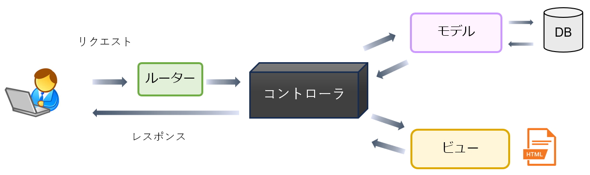

Laravel では、モデル、ビュー、コントローラ、そしてルータ（ルーティング）が主要な役割を果たします。

もちろんこれら以外のものも Laravel には備わっていますが、これらはアプリの基本となるもので、これらの役割等について、ここでは見て行きます。

イメージ画面

### ルータ（ルーティング）
URL やリクエストメソッド（GET or POST 等）に応じて、処理を行うコントローラを呼び出す機能です。
コントローラを呼び出す代わりに、このルータ内に処理を直接記述する事もできます（本講座ではこれを多用します）。ですが、実際のアプリ開発ではコントローラを別途定義し、そのコントローラに処理を振り分けるのが現実的です。

### コントローラ
ユーザーのリクエストに応じて処理を行う所です。データベースが絡む処理はモデルに依頼し、見た目に関する処理はビューに依頼するなどして適宜処理を振り分けつつ必要な処理を記述します。

### モデル
データベースからデータを取得したり、また保存等する際に利用します。またデータベースのレコードを表現するものとして利用されます。

### ビュー
ユーザー（ブラウザ）に表示する HTML を作成します。

### 各ファイル
各ファイルは、それぞれ以下に配置します。

- ルーター ・・・ `routes/web.php`
- コントローラ ・・・ `app/Http/Controllers/`
- モデル ・・・ `app/Models/`
- ビュー ・・・ `resources/views/`
