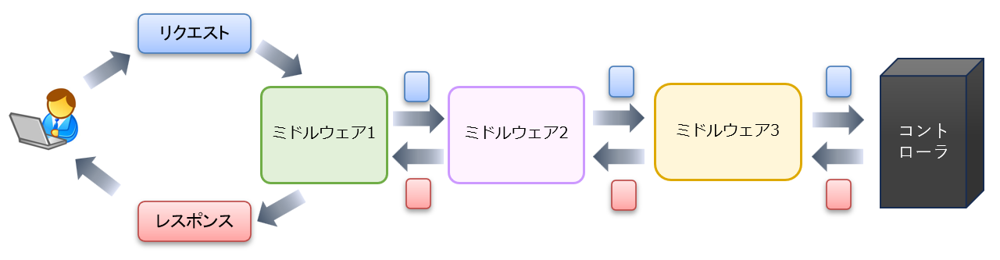

ドキュメント：[本家サイト](https://laravel.com/docs/11.x/middleware) [日本語](https://readouble.com/laravel/11.x/ja/middleware.html)

## ミドルウェアとは？
ミドルウェアは、リクエストがコントローラに到達する前、又はコントローラから抜け出した後のレスポンスに対して実行される加工又はフィルタリング等の機能です。例えば、認証、セッション、データの加工などがあります。
（コントローラに到達する前に、ミドルウェアによって返却処理される事もあります）




上の図でも見て取れる通り、ミドルウェアは、コントローラーに向かって行く時の処理（前処理）とコントローラーから出て行く時の処理（後処理）の二つの処理の段階があります。

1つのミドルウェアが、前処理と後処理の両方で何か処理をやってもOKですし、片側だけで処理をするというのでもOKです。（通常は後者）

## 標準で用意されているミドルウェア
標準では、以下の3種類のミドルウェアがあります。
1. グローバルなミドルウェア
2. グループで適用されるミドルウェア
3. 必要に応じて適用するミドルウェア

Laravel 11 未満では、`app\Http\Kernel.php` でミドルウェアの一覧を確認することができましたが、Laravel 11 からは、フレームワーク側に取り込まれてしまい、すぐには確認できなくなりましたが、代わりにドキュメントで確認できます。

### グローバルなミドルウェア
必ず適用（全体的に適用）されるミドルウェアです。以下があります。

```php
\Illuminate\Http\Middleware\TrustHosts::class, // 信頼するホストの設定。ここだけデフォルト無効。
\Illuminate\Http\Middleware\TrustProxies::class, // 信頼するプロキシの設定
\Illuminate\Http\Middleware\HandleCors::class, // CORS 処理
\Illuminate\Foundation\Http\Middleware\PreventRequestsDuringMaintenance::class, // メンテ表示処理
\Illuminate\Http\Middleware\ValidatePostSize::class, // POST データの最大サイズ超過時の処理
\Illuminate\Foundation\Http\Middleware\TrimStrings::class,
\Illuminate\Foundation\Http\Middleware\ConvertEmptyStringsToNull::class,
```

下の2つの `TrimStrings` は、ユーザーからの入力値の前後にあるホワイトスペース（空白や改行など）を取り除きます。
`ConvertEmptyStringsToNull` は、ユーザーからの入力値で空の文字列を `null` に変換します。

### グループで適用されるミドルウェア
ここで言うグループには、`web` と `api` の2つのグループがあります。 `web` 用のミドルウェアには、以下があり、`routes/web.php` に記載したルートに対してデフォルトで適用されます。

```php
\Illuminate\Cookie\Middleware\EncryptCookies::class, // クッキーの暗号化
\Illuminate\Cookie\Middleware\AddQueuedCookiesToResponse::class, // キューに入ったクッキーの送信
\Illuminate\Session\Middleware\StartSession::class, // セッション開始
\Illuminate\View\Middleware\ShareErrorsFromSession::class, // $errors 変数をどの view でも使えるように
\Illuminate\Foundation\Http\Middleware\ValidateCsrfToken::class, // CSRF トークンチェック
\Illuminate\Routing\Middleware\SubstituteBindings::class, // モデル結合（Model Binding）
```

`api` 用のミドルウェアは、Laravel 11 からは、デフォルトでは表面上は存在しなくなりましたので、ここでは割愛させていただきます。

### ルートレベルで任意で適用するミドルウェア
設定したルートに対し、任意で適用するミドルウェアです。エイリアス（短い名前）が用意されているので、そのエイリアスで指定できます。

```php
// 一部抜粋（ドキュメントで全てを確認できます）
'auth' => \Illuminate\Auth\Middleware\Authenticate::class,
'can' => \Illuminate\Auth\Middleware\Authorize::class,
'guest' => \Illuminate\Auth\Middleware\RedirectIfAuthenticated::class,
```

よく使われるものとして、`auth` と `guest` があります。`auth` は、いわゆる認証機能です。認証済みでないと会員ページを見られなくし、ログインページへリダイレクトさせます。`guest` は、`auth` の逆に相当し、認証済みの時は特定のページ（ログイン画面など）を見られなくし、会員ページへリダイレクトさせます。

以下は、web.php にて `auth` ミドルウェアを適用する例です。

```php
// 個別のルートに指定する場合
Route::get('member', [IndexController::class, 'index'])
    ->middleware('auth');   // 配列での指定も可 ->middleware(['auth'])

// グループ化して適用する場合
Route::middleware('auth')->group(function () {
    Route::get('member', [IndexController::class, 'index']);
    // 以下続く...
});
```
